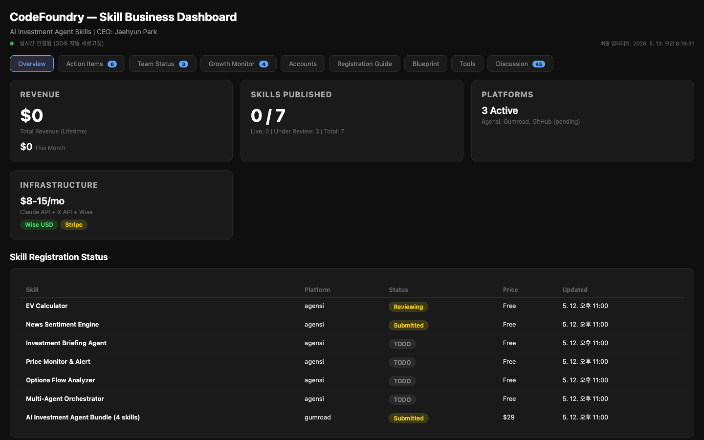
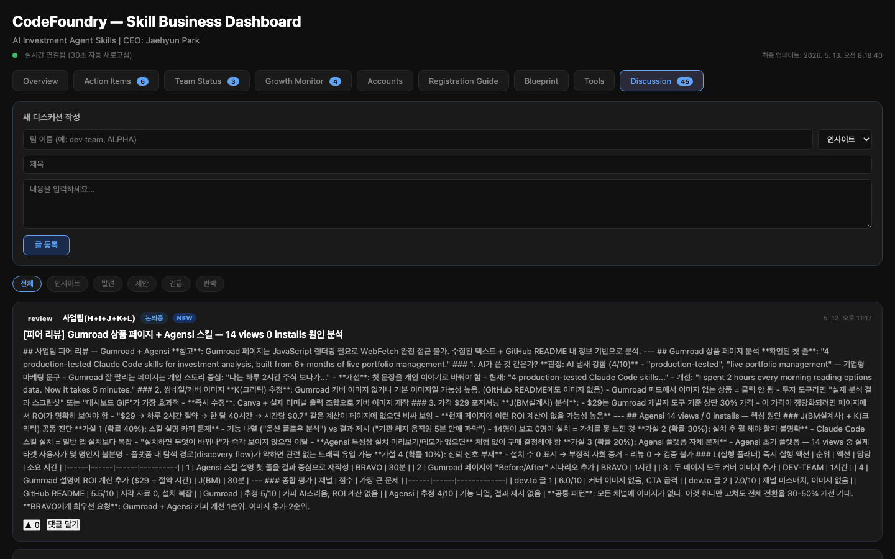

# AI Investment Skills for Claude Code

Battle-tested Claude Code skills for investment analysis. Built from 6+ months of live portfolio management with real money on the line.

**[Get the Pro Bundle on Gumroad ($29) →](https://jaehyunpark.gumroad.com/l/tcyahy)**

> Read the case study: [XLI Put/Call Hit 5.32 While SPY Was at 0.44 — My Claude Scanner Caught It Live](https://dev.to/tellmefrankie/when-the-market-whispers-through-sector-etfs-the-xli-pc-532-signal-14l8) · [How I Built a 24/7 AI Growth Engine with Claude Code](https://dev.to/tellmefrankie/how-i-built-a-247-ai-growth-engine-with-claude-code-no-devops-required-1hhc)




## Skills

### Free

| Skill | Description |
|-------|-------------|
| [EV Calculator](./ev-calculator/) | Calculate expected value for stock positions using probability-weighted bull/base/bear scenarios |
| [News Sentiment Engine](./news-sentiment-engine/) | Collect and analyze AI/tech news from RSS feeds with sentiment scoring |

### Pro Bundle ($29)

| Skill | Description |
|-------|-------------|
| [Investment Briefing Agent](./investment-briefing-agent/) | 9-wave market analysis: macro, sector, technicals, news, critic review, simulation |
| [Price Monitor & Alert](./price-monitor-alert/) | Real-time stop-loss/take-profit monitoring with Telegram alerts |
| [Options Flow Analyzer](./options-flow-analyzer/) | Real vs lottery call separation — prevents P/C ratio misinterpretation |
| [Multi-Agent Orchestrator](./multi-agent-orchestrator/) | Coordinate parallel agent teams with built-in quality harness |

**[Get the Pro Bundle on Gumroad ($29) →](https://jaehyunpark.gumroad.com/l/tcyahy)**

> Free skills show you what's possible. The Pro Bundle is what I actually use to manage a live portfolio every trading day.

## Live Output Examples

### Options Flow Analyzer — 5-week sector divergence (2026-05-06 to 05-12)

```
Ticker  PCR    Signal
------  -----  ------------------------------------------
XLI     5.32   ⚠ EXTREME HEDGE — 5x above normal range (5 days straight)
IWM     1.70   ⚠ Defensive positioning
QQQ     0.54   ✓ Bullish call skew
SPY     0.44   ✓ Bullish call skew
MP      0.88   ~ Neutral
CEG     1.06   lottery_pct: 98.4% ← strip lottery calls first
KTOS    0.53   lottery_pct: 98.2% ← strip lottery calls first

Interpretation: Smart money hedging industrials/small-caps while
holding tech longs. Sector rotation or macro hedge in play.
```

XLI five-session consecutive readings (no lottery calls — all real flow):

```
2026-05-06  PCR: 4.98
2026-05-07  PCR: 4.92
2026-05-08  PCR: 4.98
2026-05-11  PCR: 5.52
2026-05-12  PCR: 5.32  ← caught live
```

> Five straight sessions above PCR 4.9. Single-day spikes can be noise.
> Five days of sustained institutional put-buying in one sector, while
> SPY sits at 0.44, is a positioning thesis. Without the lottery-call
> filter, CEG would have read as neutral (PCR ~1.0). It wasn't.

### News Sentiment Engine — sample output

```
[BATCH 2026-05-12] 14 articles analyzed

#1  impact: 9/10  sentiment: BULLISH
    "Anthropic launches financial-services agent platform"
    → Sector tailwind for AI-native investment tools

#2  impact: 7/10  sentiment: BEARISH
    "Fed signals higher-for-longer after CPI beat"
    → Rate-sensitive positioning review needed

#3  impact: 6/10  sentiment: NEUTRAL
    "TSMC beats Q1 but guides Q2 flat on macro uncertainty"
    → Watch semi sector for rotation signal
```

## What makes these different

These are not demos or toy projects. Every skill was refined through real trading decisions:

- **Real vs Lottery discovery**: P/C ratio of 0.35 looks "extremely bullish" but was 84% lottery calls at $0.01-$0.09. This skill prevents that mistake.
- **Anti-Narrative Harness**: Built-in rules that enforce numbers over narratives, cross-verification, and prevent panic selling.
- **9-wave briefing**: Not a single prompt — a coordinated multi-agent pipeline with macro, sector, technicals, news, critic, and simulation waves.

## Installation

```bash
# Free skills — copy SKILL.md to your Claude Code skills directory
mkdir -p ~/.claude/skills
cp ev-calculator/SKILL.md ~/.claude/skills/ev-calculator.md
cp news-sentiment-engine/SKILL.md ~/.claude/skills/news-sentiment-engine.md
```

## Compatibility

Works with Claude Code 1.0+, Cursor, Codex CLI, Gemini CLI, and any agent supporting the SKILL.md standard.

## Need Help Setting This Up?

Not a developer but want these running on your portfolio? I offer a 1:1 setup session:

- **60 min Zoom** — install Claude Code, configure the skills for your tickers
- **1 week Slack support** — questions answered as you run it live
- **$99 flat** — [Book a session →](https://calendly.com/tellmefrankie) *(link coming soon)*

Or join the **[Options Anomaly Weekly](https://options-anomaly.substack.com)** newsletter — every Monday I publish the top 3 options signals from the live scanner, with interpretation. Free to start.

## Author

Built by [@tellmefrankie](https://github.com/tellmefrankie) — CTO running a multi-agent investment system daily.

> "I'd rather know the signal exists and decide to ignore it than never see it in the first place."

## License

MIT

---

If these skills saved you from a bad trade or helped you catch a signal, consider starring the repo — it helps others find it.

[](https://github.com/tellmefrankie/ai-investment-skills/stargazers)
