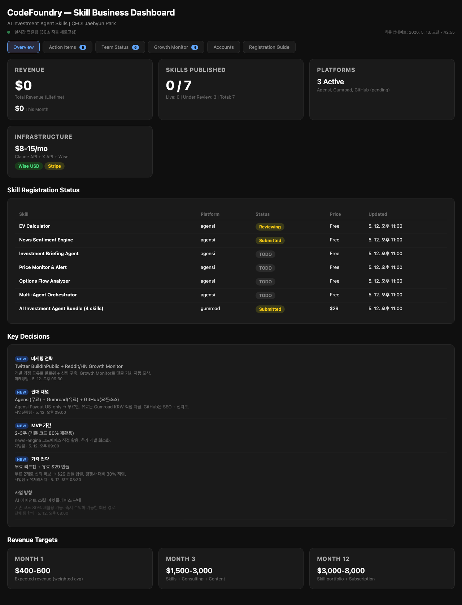

# Reddit Post Draft — r/ClaudeAI — 2026-05-13

---

**Title:** I built 6 Claude Code skills that run my real-money stock portfolio — options flow, stop-loss alerts, daily briefings (open source)

---

**Body:**

For the past few weeks I've been using Claude Code skills to manage an actual portfolio with real money. Today I'm open-sourcing everything.

## What the system does

Every morning before the US market opens, a multi-agent pipeline runs automatically:

1. **Options Flow Analyzer** — pulls live P/C ratios via Polygon API and classifies sentiment
2. **News Sentiment Engine** — scans headlines for each position and scores bullish/bearish signals
3. **Investment Briefing Agent** — synthesizes everything into a daily markdown briefing
4. **Price Monitor & Alert** — watches stop-loss levels and fires Telegram alerts
5. **EV Calculator** — expected-value scoring for new trade candidates
6. **Multi-Agent Orchestrator** — coordinates all of the above in one Claude Code skill run

## Today's live output (2026-05-13)

**Options Sentiment (Polygon API):**

| Ticker | P/C Ratio | Signal |
|--------|-----------|--------|
| SPY | 0.44 | Extreme Bullish |
| QQQ | 0.54 | Bullish |
| RXRX | 0.38 | Extreme Bullish |
| TEM | 0.50 | Bullish |
| IREN | 0.83 | Neutral-Bullish |
| CEG | 1.06 | Weak Bearish |

**Portfolio snapshot:**
- TEM: $48.67 — 2.2% from stop-loss (watch)
- IREN: $55.15 — safe
- MP: $66+ — safe
- CEG: $299.69 — safe
- RXRX: $3.26 — safe

## Dashboard screenshots

## Why I built this instead of using existing tools

Most retail tools give you indicators. Claude Code lets you **write the logic in plain English** and chain agents together. The options flow skill took about 2 hours to build and now runs hands-free every morning.

The key differentiation vs other open-source trading bots: I separate "real" options flow (institutional hedging signal) from "lottery" options (retail YOLO flow). The P/C ratio alone doesn't tell you that — the skill does.

## Links

- **GitHub (free, open source):** https://github.com/tellmefrankie/ai-investment-skills
- **Gumroad bundle ($29 — pre-configured + walkthrough):** https://jaehyunpark.gumroad.com/l/tcyahy

Happy to answer questions about the architecture or how to adapt it to your own positions. This is Day 1 of building in public — follow along if you're interested.

---

*Note: This is not financial advice. I'm sharing the tooling, not the trades.*
